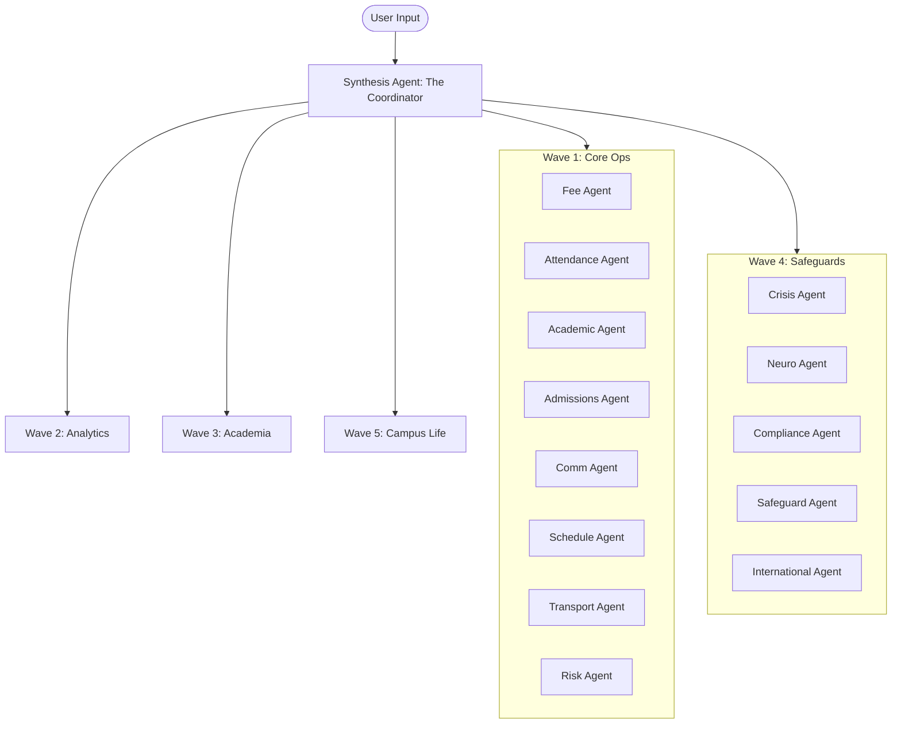

# ScholarMind V6 — AI Swarm & Agentic Operations Specification

This document defines the 26-agent cognitive AI swarm, tool registries, reasoning execution loops, and Human-in-the-Loop (HITL) safety governance.

## 🤖 Swarm Architecture & Release Waves

The ScholarMind swarm divides cognitive workloads across 26 specialized agents organized in 5 deployment phases:



---

## 🔁 Agent Reasoning Loop

Each agent operates on a ReAct-based execution loop bounded by `settings.max_tool_calls`:

1. **Query & Context Retrieval**: Fetch up to 5 vector matches per collection defined in `collections()`.
2. **System Prompt Formulation**: Build the LLM payload integrating role prompts, RAG context, and the query.
3. **Execution Iteration**:
    - Query LLM (with thinking template activated).
    - If a Tool Call is returned: execute, append result, and loop.
    - If standard content is returned: finalize response, write database audit log, and return.

---

## 🛡️ Human-in-the-Loop (HITL) Queue & Approval Rules

Any tool configuration that mutates structural database records (e.g. altering invoices, changing grades, revoking certificates) MUST activate the `requires_human_approval` flag.

### Scenario: Safe Interception of a Write Action
```gherkin
Given a Fee Agent executing a tool called "refund_invoice"
And the tool has "requires_human_approval" set to True
When the LLM triggers the tool call with arguments:
  | invoice_id | "a8e94f31-8cae-4f51-b851-7fba0b99480d" |
  | amount     | 5000                                  |
Then the Tool Registry MUST bypass immediate execution
And insert a row in the `agent_approvals` table with status "PENDING" and priority "HIGH"
And return a response payload containing:
  | status  | "PENDING_HUMAN_APPROVAL"                                                   |
  | message | "This action is high-risk and requires human administrator approval..."     |
```

### Scenario: Review Execution on Approval
```gherkin
Given a PENDING approval record with ID "590f2302-864c-4740-96f3-a75d1f887b40"
When a staff member triggers a review with action "APPROVED"
Then the API router MUST update the `agent_approvals` status to "APPROVED"
And execute the proposed tool action using the stored arguments
And return the execution results to the client
```
