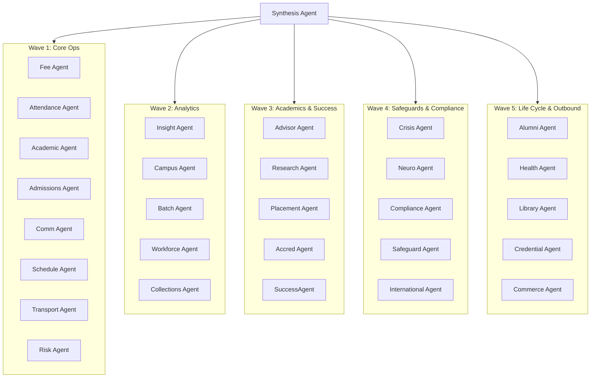

# ScholarMind V6 — Detailed AI Swarm & Agentic Operations Specification

This specification documents the exact configurations, behaviors, capabilities, and safety structures of the 26 domain-specific AI agents that comprise the ScholarMind Swarm.

---

## 1. The 26-Agent Swarm Structure

ScholarMind groups its agent fleet into 5 deployment waves according to dependencies, data access, and functional domains:



---

## 2. Comprehensive Agent Registry (Definitions & Scopes)

### 2.1 Wave 1: Core Operations

1. **SynthesisAgent**:
   - **Role**: Swarm dispatcher and synthesis hub.
   - **Responsibilities**: Routes natural language queries to specialized agents, parses raw agent responses, and aggregates multi-agent outputs.
   - **Collections**: Searches all metadata collections for correct routing.
   
2. **FeeAgent**:
   - **Role**: Treasury and billing analyzer.
   - **Responsibilities**: Queries tuition records, builds grade-wise collection sheets, tracks overdue invoices, and models payment default risks.
   - **Collections**: `fee_records`, `student_profiles`.
   - **Tools**: `query_overdue_invoices`, `get_student_fee_history`, `get_payment_trends`.

3. **AttendAgent**:
   - **Role**: Student presence monitor.
   - **Responsibilities**: Analyzes multi-modal student attendance data, detects chronic absenteeism, and flags cross-campus attendance patterns.
   - **Collections**: `attendance_records`, `student_profiles`.

4. **AcademAgent**:
   - **Role**: Curriculum & Grading compliance.
   - **Responsibilities**: Manages lesson plan statuses, elective course mapping, prerequisite validations, and core grade books.
   - **Collections**: `curriculum_plans`, `grade_books`.

5. **AdmitAgent**:
   - **Role**: Admissions funnel manager.
   - **Responsibilities**: Processes applications, parses intake documentation, and flags missing admission criteria.
   - **Collections**: `admission_applications`, `student_profiles`.

6. **CommAgent**:
   - **Role**: Notification and dispatch driver.
   - **Responsibilities**: Automates multilingual alerts to parents, routes communications, and maps channels (SMS/Email/WhatsApp).
   - **Collections**: `communication_templates`, `user_contacts`.

7. **SchedulAgent**:
   - **Role**: Time-table constructor.
   - **Responsibilities**: Generates conflict-free timetables for sections, courses, and exams. Resolves room and faculty capacity clashes.
   - **Collections**: `timetable_schedules`, `classroom_resources`.

8. **TransportAgent**:
   - **Role**: Logistics coordinator.
   - **Responsibilities**: Tracks bus routes, maps vehicle capacities, and monitors driver schedules.
   - **Collections**: `transport_routes`, `student_profiles`.

9. **RiskAgent**:
   - **Role**: Drop-out prevention engine.
   - **Responsibilities**: Runs dropout prediction models by correlating fee defaults, attendance drops, and grade declines.
   - **Collections**: `student_profiles`, `attendance_records`, `fee_records`.

---

### 2.2 Wave 2: Analytics & Scale

10. **InsightAgent**:
    - **Role**: Cross-entity performance analyzer.
    - **Responsibilities**: Formulates benchmarking matrices and tracks operational KPIs across institutional networks.
    
11. **CampusAgent**:
    - **Role**: Multi-campus operations balancer.
    - **Responsibilities**: Oversees teacher sharing pools, cross-campus transfers, and central policy distributions.

12. **BatchAgent**:
    - **Role**: Coaching center batch coordinator.
    - **Responsibilities**: Schedules test series, evaluates rank listings, and routes student doubt tickets.

13. **WorkforceAgent**:
    - **Role**: Staffing capacity planner.
    - **Responsibilities**: Tracks faculty workloads, coordinates substitutions, and logs contractor hours.

14. **CollectionsAgent**:
    - **Role**: Treasury collections planner.
    - **Responsibilities**: Generates debt-aging tables, flags high-risk accounts, and schedules billing reminders.

---

### 2.3 Wave 3: Academic Advising & Outcomes

15. **AdvisorAgent**:
    - **Role**: Student academic pathfinder.
    - **Responsibilities**: Evaluates graduation readiness, reviews course prerequisites, and recommends electives.

16. **ResearchAgent**:
    - **Role**: Research grant manager.
    - **Responsibilities**: Tracks publication outputs, monitors grant disbursements, and processes ethical clearances.

17. **PlacementAgent**:
    - **Role**: Corporate relations driver.
    - **Responsibilities**: Maps student profiles to job descriptions, manages interview calendars, and tracks offers.

18. **AccredAgent**:
    - **Role**: Continuous quality audit coordinator.
    - **Responsibilities**: Aggregates accreditation evidence and drafts Self-Study Reports (SSR).

19. **SuccessAgent**:
    - **Role**: Care coordination manager.
    - **Responsibilities**: Builds care plans for students flagged by the RiskAgent and tracks intervention outcomes.

---

### 2.4 Wave 4: Safeguards & Compliance

20. **CrisisAgent**:
    - **Role**: Emergency protocol dispatcher.
    - **Responsibilities**: Enforces campus lockdowns and coordinates emergency messaging.

21. **NeuroAgent**:
    - **Role**: SEN (Special Educational Needs) coordinator.
    - **Responsibilities**: Monitors Individualized Education Program (IEP) compliance.

22. **ComplianceAgent**:
    - **Role**: Regulatory audit auditor.
    - **Responsibilities**: Reviews child-safety logs, checks data residency rules, and verifies regulatory calendars.

23. **SafeguardAgent**:
    - **Role**: Child safety warden.
    - **Responsibilities**: Audits incident reports and manages access authorization logs for sensitive files.

24. **IntlAgent**:
    - **Role**: Expatriate logistics coordinator.
    - **Responsibilities**: Monitors student visa deadlines and validates multi-currency tax splits.

---

### 2.5 Wave 5: Lifecycles & Portability

25. **AlumniAgent**:
    - **Role**: Graduate engagement tracker.
    - **Responsibilities**: Records career progressions and coordinates donation drives.

26. **HealthAgent**:
    - **Role**: Medical safety coordinator.
    - **Responsibilities**: Monitors immunization records and logs clinic incidents.

27. **LibraryAgent**:
    - **Role**: Resource catalog coordinator.
    - **Responsibilities**: Audits catalog allocations and processes inter-library loans.

28. **CredentialAgent**:
    - **Role**: Secure record issuer.
    - **Responsibilities**: Packages verifiable academic credentials using cryptographically signed formats.

29. **CommerceAgent**:
    - **Role**: Cohort billing executor.
    - **Responsibilities**: Processes recurring subscription renewals and manages sponsor payments.

---

## 3. Human-In-The-Loop (HITL) Validation Specification

High-risk write operations must be intercepted by the tool registry. The following Gherkin scenarios specify this pipeline:

### Scenario: Intercepting a high-risk mutation
```gherkin
Given a tool called "update_student_grade"
And its requires_human_approval property is configured to TRUE
When the AcademAgent attempts to call "update_student_grade" with arguments:
  | student_id | "a1b2c3d4-e5f6-7a8b-9c0d-1e2f3a4b5c6d" |
  | new_grade  | "A+"                                  |
Then the execution context MUST:
  1. Halt execution of the handler.
  2. Create a record in `agent_approvals` table with status "PENDING".
  3. Respond to the calling agent with status "PENDING_HUMAN_APPROVAL".
```

### Scenario: Confirming review processing
```gherkin
Given a PENDING approval record with ID "9b1deb4d-3b7d-4bad-9bdd-2b0d7b3dcb6d"
When the administrator reviews the action as "APPROVED"
Then the API layer MUST:
  1. Transition the database status to "APPROVED".
  2. Fetch the stored arguments from `proposed_action`.
  3. Execute the target tool "update_student_grade" with the stored arguments.
  4. Return the database updates back to the UI.
```
