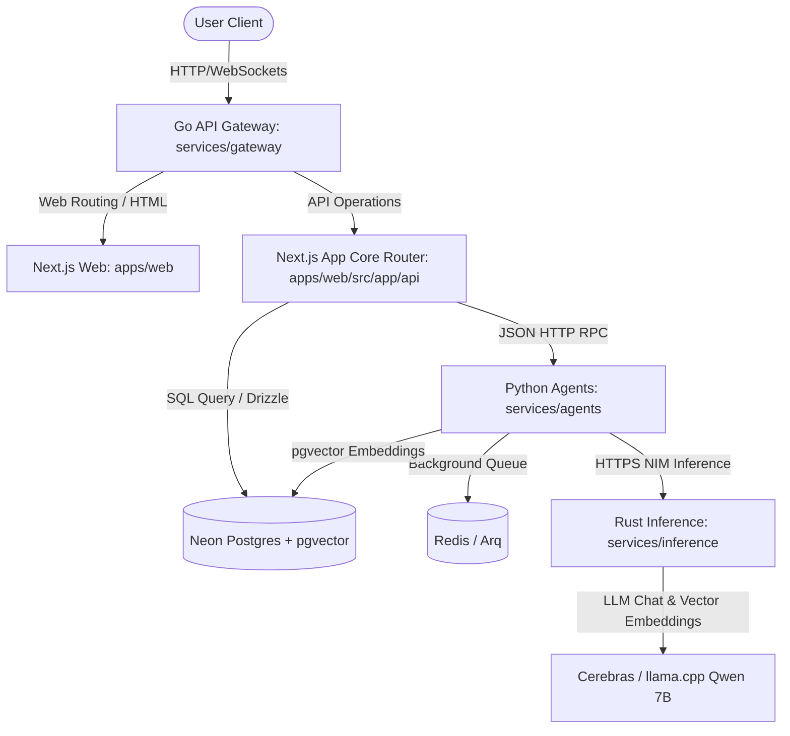

# ScholarMind V6 — Global Architecture Specification

This document provides the global architecture specification and directory mapping for ScholarMind.

## 🏛️ System Topology

ScholarMind utilizes a modular, hybrid architecture split between presentation, gateway, routing, core business APIs, and background agentic execution.



---

## 📂 Comprehensive Monorepo Directory Mapping

Below is the exhaustive categorization, ownership, and role mapping of the directories in the ScholarMind repository:

| Directory Path | Clean Architecture Tier | Primary Owner | Operational Role & Purpose |
| :--- | :--- | :--- | :--- |
| `apps/web/` | Presentation & Core API | Frontend & Product Team | The primary web application (Next.js 15), exposing user dashboard, multi-tenant authentication, and direct Drizzle schema integration. |
| `apps/web/src/app/` | Presentation Layer | Frontend Team | Next.js App Router folders defining pages, layouts, and server actions for dashboards. |
| `apps/web/src/lib/db/` | Data Access Layer | Database & Backend Lead | Core database adapters, connection pooling configurations, and query clients. |
| `apps/web/src/lib/db/schema/` | Domain / Entity Layer | Database & Backend Lead | Exhaustive list of 33 schema definition files declaring relational schemas and associations. |
| `apps/web/drizzle/` | Data Migration Layer | Database & Backend Lead | Automatically generated SQL migration scripts generated by `drizzle-kit`. |
| `apps/website/` | Public Marketing Site | GTM & Web Marketing Team | Next.js landing pages, marketing assets, and public info pages. |
| `backend/` | Legacy / Reference Data | Legacy Arch Group | Retained database migration reference scripts (`V1__initial_schema.sql`). |
| `services/gateway/` | Gateway / Security Layer | Infra & DevOps Team | High-performance Go-based API gateway responsible for rate limiting, CORS management, and internal request routing. |
| `services/agents/` | Cognitive AI Swarm Layer | AI Swarm & Python Dev Team | Python FastAPI microservice housing the 26 domain-specific agents, tool registries, vector ingestion, and background job queue listeners. |
| `services/agents/src/agents/` | Domain Logic / AI Layer | AI Swarm Team | Codebases for all 2 domain waves (FeeAgent, SynthesisAgent, RiskAgent, and stub implementations). |
| `services/agents/src/core/` | System Infrastructure Tier | Platform Team | The baseline frameworks for AI operations: Base `Agent` loops, `ToolRegistry`, pgvector `RAGPipeline`, `agent_approvals` flows. |
| `services/agents/src/indexing/` | Ingestion / Data Layer | RAG & Search Engineer | Ingestion listeners and data translation pipelines converting SQL rows to natural language strings for pgvector embedding. |
| `services/agents/sql/` | Schema / Vector Layer | AI Swarm Team | SQL initialization tables, indices, and triggers enforcing pgvector schema (`001_embeddings.sql`, `002_triggers.sql`). |
| `services/inference/` | Inference / Model Tier | LLM & Inference Team | High-efficiency Rust-based wrapper for local/NIM model chat completions and vector embedding operations. |
| `docs/` | System Documentation | Product & Tech Writers | Deployment guidelines, PRDs, security audits, quickstarts, and specifications. |

---

## 🔒 Security & Multi-Tenant Sandbox Specification

Every query, mutation, and tool execution MUST enforce the multi-tenant isolation sandboxing.

### Scenario: Intercepting Cross-Tenant Tool Abuse
```gherkin
Given a User with tenant_id "85815f66-8641-452d-9a0a-a95e4e383e53"
And the Synthesis Agent is executing a tool called "get_student_fee_history"
When the LLM generates a tool argument with target tenant_id "20e22540-4f11-4403-9632-24425bbd9b76"
Then the Tool Registry execution sandbox MUST intercept the argument
And overwrite the tenant_id to the trusted session tenant "85815f66-8641-452d-9a0a-a95e4e383e53"
And raise a warning log "security_cross_tenant_violation_prevented"
```
