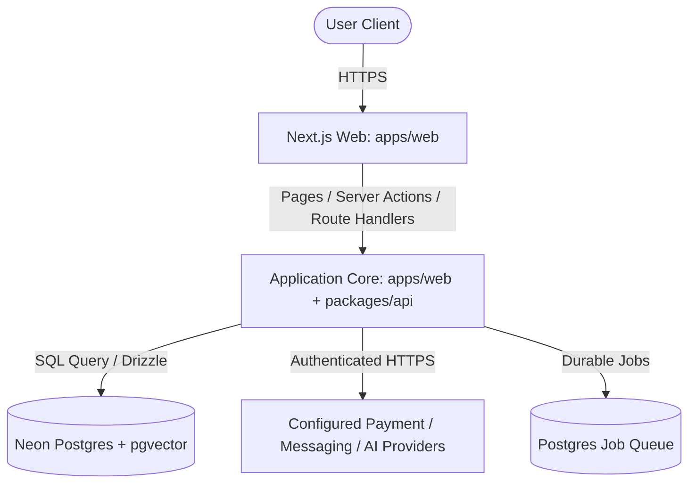

# ScholarMind V6 — Current Global Architecture Specification

This document describes the runtime architecture and directory mapping that are present in the current ScholarMind repository.

## 🏛️ System Topology

ScholarMind ships as a Next.js application whose pages, server actions, route handlers, and application-level security controls share one deployable. The hosting platform terminates HTTPS and forwards requests directly to `apps/web`; there is no repository-owned API gateway in the request path.


```mermaid
graph TD
    User([User Client]) -->|HTTPS| FE[Next.js Web: apps/web]
    FE -->|Pages / Server Actions / Route Handlers| BE[Application Core: apps/web + packages/api]
    BE -->|SQL Query / Drizzle| DB[(Neon Postgres + pgvector)]
    BE -->|Authenticated HTTPS| Providers[Configured Payment / Messaging / AI Providers]
    BE -->|Durable Jobs| Queue[(Postgres Job Queue)]
```

Authentication, tenant authorization, security headers/CSP, endpoint-specific CORS behavior, request validation, and rate limiting are enforced in `apps/web`. Provider callbacks authenticate inside their route handlers. The managed hosting edge is transport and deployment infrastructure, not an application authorization boundary.

### Retired Go gateway

The experimental `services/gateway` reverse proxy was removed on 2026-07-18 because it was not built, deployed, tested, or referenced by the application. It is not a production component and must not be restored or exposed as an edge without a new reviewed design that includes authenticated routes, allowlisted CORS, request-size and timeout limits, upstream health checks, observability, tests, and CI/deployment ownership.

---

## 📂 Comprehensive Monorepo Directory Mapping

Below is the exhaustive categorization, ownership, and role mapping of the directories in the ScholarMind repository:

| Directory Path | Clean Architecture Tier | Primary Owner | Operational Role & Purpose |
| :--- | :--- | :--- | :--- |
| `apps/web/` | Presentation & Core API | Frontend & Product Team | The primary web application (Next.js 16), exposing dashboards, multi-tenant authentication, route handlers, and server actions. |
| `apps/web/src/app/` | Presentation Layer | Frontend Team | Next.js App Router folders defining pages, layouts, and server actions for dashboards. |
| `packages/api/src/db/` | Data Access Layer | Database & Backend Lead | Core database adapters, pool configuration, transaction-local tenant context, and query clients. |
| `packages/api/src/db/schema/` | Domain / Entity Layer | Database & Backend Lead | Typed Drizzle schema definitions and associations. |
| `apps/web/drizzle/` | Data Migration Layer | Database & Backend Lead | Automatically generated SQL migration scripts generated by `drizzle-kit`. |
| `apps/website/` | Public Marketing Site | GTM & Web Marketing Team | Next.js landing pages, marketing assets, and public info pages. |
| `packages/api/` | Domain & Data Layer | Backend Team | Shared typed schema, database access, domain services, and server-side contracts used by the web application. |
| `ops/observability/` | Operational Assets | Platform Team | Importable monitoring dashboards and alert rules for the deployed application. |
| `docs/` | System Documentation | Product & Tech Writers | Deployment guidelines, PRDs, security audits, quickstarts, and specifications. |

---

## 🔒 Security & Multi-Tenant Sandbox Specification

Every query, mutation, and tool execution MUST enforce the multi-tenant isolation sandboxing.

### Scenario: Intercepting Cross-Tenant Tool Abuse
```gherkin
Given a User with tenant_id "85815f66-8641-452d-9a0a-a95e4e383e53"
And the Synthesis Agent is executing a tool called "get_student_fee_history"
When the LLM generates a tool argument with target tenant_id "20e22540-4f11-4403-9632-24425bbd9b76"
Then the Tool Registry execution sandbox MUST intercept the argument
And overwrite the tenant_id to the trusted session tenant "85815f66-8641-452d-9a0a-a95e4e383e53"
And raise a warning log "security_cross_tenant_violation_prevented"
```
