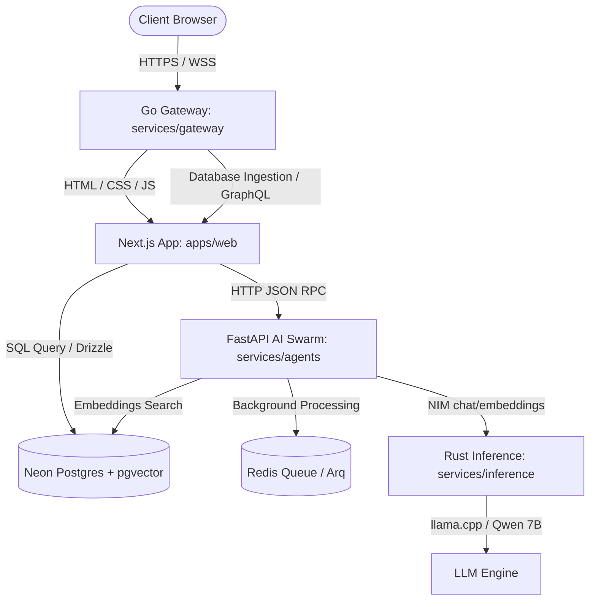
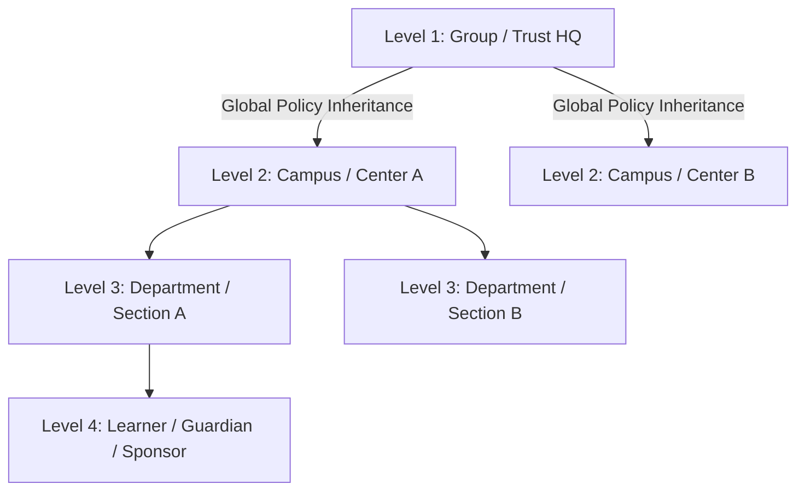

# ScholarMind V6 — Comprehensive Architecture & Deployment Specification

This specification document outlines the complete architectural design, service topology, deployment models, multi-campus hierarchy, and security control systems for ScholarMind V6.

---

## 1. Global Topology & Service Architecture

ScholarMind V6 is composed of five distinct service layers designed for modularity, strict security isolation, and high performance.



### 1.1 The Five Service Layers

1. **Presentation & Core API Layer (`/apps/web`)**:
   - **Framework**: Next.js 15 (App Router).
   - **Database ORM**: Drizzle ORM (fully typed mapping).
   - **Authentication**: NextAuth / IronSession tracking tenant scope (`tenantId`) and user role (`role`).
   - **Responsibility**: Serving responsive web views (Tailwind CSS, Tremor dashboards) and executing server-side transactional mutations.
   
2. **AI Swarm Orchestration Layer (`/services/agents`)**:
   - **Framework**: Python FastAPI.
   - **Responsibility**: Directing queries to the 26 specialized agents, matching RAG pipelines, managing tool registries, executing local business tools, and queueing background tasks.
   
3. **Rust Inference Engine (`/services/inference`)**:
   - **Framework**: Rust (Cargo).
   - **Responsibility**: Exposing high-performance APIs for local LLM inference (using llama.cpp or NIM endpoints) and text-to-vector embedding generation.
   
4. **API Gateway Layer (`/services/gateway`)**:
   - **Framework**: Go.
   - **Responsibility**: Routing requests, enforcing rate limits, parsing authentication cookies, handling CORS headers, and load balancing traffic.
   
5. **Data & Storage Layer**:
   - **Neon Postgres**: Primary transactional and relational store.
   - **pgvector**: Cosine and Euclidean vector distance database extension.
   - **Redis**: Persistent background job queue (Arq) and token tracking.

---

## 2. Tenancy, Regional Hosting & Deployment Matrix

To satisfy institutional policies, local regulations, and performance requirements, ScholarMind V6 specifies five distinct hosting models:

| Deployment Model | Target Segment | Data Residency Posture | Operational Configuration |
| :--- | :--- | :--- | :--- |
| **Shared Multi-Tenant SaaS** | Single Schools, Coaching Centers, Standard Colleges | Logical tenant isolation via `tenantId` columns. Single pooled Neon database instance. | Shared Vercel/Neon resources. Automatic scaling. Updates pushed immediately. |
| **Regional SaaS** | Large school groups spanning multiple states or nations | Regional data clusters (e.g., EU-only, India-only) using dedicated Neon regional databases. | Common product codebase. Updates regionalized. |
| **Dedicated Single-Tenant** | Large Research Universities, Premium Education Systems | Physical isolation. Dedicated database instances and isolated Kubernetes runtimes. | Customer-managed maintenance windows. Staged release testing. |
| **Private / Sovereign Cloud** | Public education networks, defense-contracted campuses | Deployments inside sovereign environments (e.g. GovCloud). High change control. | Complete offline/restricted networking. Air-gapped builds. |
| **Air-gapped Edge Nodes** | Low-connectivity rural schools, crisis zones | Local SQLite database replicating to Neon when connection is available. | Offline LLM capability. Low-latency edge computing. |

---

## 3. The Multi-Campus Hierarchy & Policy Model

ScholarMind V6 models complex education networks using a strict four-level hierarchical inheritance tree:



### 3.1 Policy Inheritance Rules
1. **Financial Policies**: HQ defines fee plans, payment gateway routers, and refund boundaries. Individual campuses configure payment options within those boundaries.
2. **Academic Standards**: Global grading systems (e.g. CBSE, IB, UGC credit structures) are configured at Level 1. Campuses inherit curricula and can adjust only elective offerings.
3. **Data Isolation boundaries**: Multi-tenant boundaries (`tenantId`) isolate transactional databases. Users at Level 1 (`GROUP_EXECUTIVE`) can read aggregated dashboards across all Level 2 nodes, but cannot modify Level 4 records without explicit delegatory tokens.

---

## 4. Cross-Campus Transfer & Mobility Specification

### Scenario: Automatic Student Campus Transfer
When a student relocates between two campuses within the same group, the transfer pipeline must move records safely and reconcile financial differences.

```gherkin
Given a Student "Arjun Patel" registered at Campus A (Tenant ID "tenant-a")
And Arjun has an unpaid invoice balance of ₹15,000
When the Campus Principal executes "transfer_student" to Campus B (Tenant ID "tenant-b")
Then the transfer pipeline MUST:
  1. Create a matching student record at Campus B.
  2. Copy historic attendance rate (88.5%) and academic transcripts.
  3. Transfer the unpaid invoice balance of ₹15,000 to the Campus B accounting ledger.
  4. Deactivate the student profile at Campus A (status set to "TRANSFERRED").
  5. Commit all updates within a single database transaction boundary.
```

---

## 5. Security controls & Multi-Tenant Sandboxing

Every incoming command, API request, and background job execution must pass through multi-tenant validation sandboxes.

### 5.1 Sandbox Rules
- **Data Access Isolation**: Every SQL query generated by the Next.js API router or Python tool registry must include an explicit `WHERE tenant_id = ?` clause utilizing the trusted tenant ID parsed from the user's secure cookie session.
- **Prompt Injection Sanitation**: Natural language queries routed to the agent swarm must be scanned for prompt injection attacks (such as instructions to ignore safety rules or output API keys) before being passed to the LLM.
- **Dynamic Rate Limiting**: Redis tracks queries per minute per user. If a user exceeds their tier limits, requests are dropped with a HTTP 429 Too Many Requests response.
