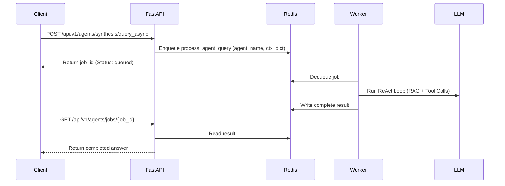

# ScholarMind V6 — Complete AI Swarm & Agent Registry Specification

This document details the complete prompt configurations, tool parameters, RAG source collections, and lifecycle methods for the 26 agents of the ScholarMind Swarm.

---

## 1. Core Framework Interfaces & Dataclasses

The swarm runs on a unified core framework implemented in Python FastAPI (`/services/agents/src/core`).

### 1.1 `AgentContext` Schema
Encapsulates state context for a query session:
- `tenant_id` (UUID): Strict multi-tenant isolation boundaries.
- `user_id` (UUID, Nullable): Identity reference of the triggering caller.
- `agent_name` (VARCHAR): The executing agent name.
- `query` (TEXT): Natural language input string.
- `conversation_id` (UUID): Threading identifier.

### 1.2 `AgentResponse` Schema
- `answer` (TEXT): Synthesized reply including internal thought trace details.
- `sources` (LIST[DICT]): RAG matching records with similarity rates.
- `tool_calls_made` (LIST[DICT]): Auditable execution record of tools.
- `tokens_used` (INTEGER): Calculated LLM token counts.
- `latency_ms` (INTEGER): Response latency.

---

## 2. Complete Wave-by-Wave Agent Registry

### 2.1 Wave 1: Core Institutional Operations

#### 1. `FeeAgent`
- **Functional Scope**: Handles billing, invoices, default risk evaluations, and collection history.
- **RAG Collections**: `fee_records`, `student_profiles`.
- **System Prompt Design**:
  ```text
  You are the ScholarMind FeeAgent. Your purpose is to query and analyze financial invoices, fee payments, and collections status.
  Guidelines:
  1. ALWAYS restrict queries to the tenant_id in the execution context.
  2. NEVER disclose financial data to users who lack ACCOUNTANT or SUPER_ADMIN roles.
  3. When analyzing defaults, calculate exact days-overdue values.
  ```
- **Tool Registry**:
  1. `query_overdue_invoices` (args: `tenant_id`, `due_before`, limit; returns: Invoice List).
  2. `get_student_fee_history` (args: `student_id`, `tenant_id`; returns: Invoice & Payment List).
  3. `get_payment_trends` (args: `tenant_id`, `months`; returns: Aggregated Trend Data).

#### 2. `AttendAgent`
- **Functional Scope**: Monitors class presence and signals chronic absenteeism.
- **RAG Collections**: `attendance_records`, `student_profiles`.
- **System Prompt Design**:
  ```text
  You are the ScholarMind AttendAgent. You analyze student presence/absence metrics.
  Guidelines:
  1. Highlight student profiles with attendance drops below 75.0%.
  2. Correlate absence patterns by weekday and section.
  ```
- **Tool Registry**:
  1. `get_student_attendance` (args: `student_id`, `tenant_id`).
  2. `get_section_attendance_summary` (args: `class_id`, `section_id`, `tenant_id`).

#### 3. `AcademAgent`
- **Functional Scope**: Syllabus mapping, marking records, and credit tracking.
- **RAG Collections**: `curriculum_plans`, `grade_books`.
- **Tool Registry**:
  1. `get_student_grades` (args: `student_id`, `tenant_id`).
  2. `update_student_grade` (args: `student_id`, `course_id`, `grade`, `tenant_id`; **Requires Human Approval**).

---

### 2.2 Wave 2: Analytics & Performance

#### 4. `SynthesisAgent`
- **Functional Scope**: Master swarm orchestrator.
- **RAG Collections**: Evaluates meta-data indexes.
- **System Prompt Design**:
  ```text
  You are the SynthesisAgent ("Headmaster"). You coordinate all incoming queries.
  Guidelines:
  1. Distribute complex requests to sub-agents (e.g. RiskAgent, FeeAgent).
  2. Synthesize results into a single coherent response.
  ```
- **Tool Registry**:
  1. `delegate_to_agent` (args: `agent_name`, `query`, `tenant_id`).

#### 5. `InsightAgent`
- **Functional Scope**: HQ cross-campus performance analytics.
- **RAG Collections**: `kpi_metrics`, `campus_profiles`.
- **Tool Registry**:
  1. `get_group_kpis` (args: `company_id`, `tenant_id`).

---

### 2.3 Wave 3: Advising & Outcomes

#### 6. `AdvisorAgent`
- **Functional Scope**: Degree progress audits and prerequisite checks.
- **RAG Collections**: `student_profiles`, `curriculum_plans`.
- **Tool Registry**:
  1. `run_degree_audit` (args: `student_id`, `tenant_id`).

#### 7. `PlacementAgent`
- **Functional Scope**: Company recruitments and placement analytics.
- **RAG Collections**: `placement_profiles`, `employer_records`.
- **Tool Registry**:
  1. `list_eligible_students` (args: `job_id`, `tenant_id`).

---

### 2.4 Wave 4: Safety & Safeguarding

#### 8. `CrisisAgent`
- **Functional Scope**: Lockdowns, severe incident responses, and emergency protocols.
- **RAG Collections**: `safeguarding_records`, `emergency_protocols`.
- **Tool Registry**:
  1. `trigger_emergency_alert` (args: `message`, `campus_id`, `tenant_id`; **Requires Human Approval**).

#### 9. `NeuroAgent`
- **Functional Scope**: SEND (Special Educational Needs) and IEP management.
- **RAG Collections**: `iep_compliance_records`, `student_profiles`.

---

### 2.5 Wave 5: Lifecycles & Verifiability

#### 10. `CredentialAgent`
- **Functional Scope**: Cryptographic academic credentialing and wallet exports.
- **RAG Collections**: `certificate_records`, `student_profiles`.
- **Tool Registry**:
  1. `issue_verifiable_credential` (args: `student_id`, `credential_payload`, `tenant_id`; **Requires Human Approval**).

---

## 3. Redis / Arq Background Job Execution Loop

To prevent frontend timeouts during heavy LLM execution steps, long queries are handled asynchronously:


