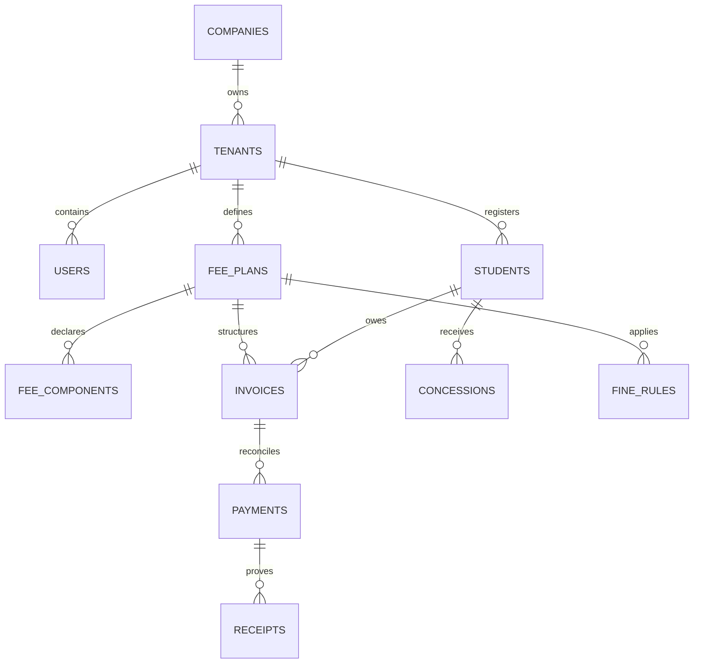

# ScholarMind V6 — Complete Database Schema & Data Access Specification

This document provides the definitive data access, relational database schema, index topology, and pgvector mapping guide for ScholarMind V6.

---

## 1. Relational Database & Entity Relationship Map

ScholarMind operates a Postgres database managed through Drizzle ORM. Tenancy isolation is enforced at the database level by partitioning tables with `tenant_id` UUID columns.



---

## 2. Global Enums & Custom Domain Types

The schema enforces strict enumerations for system behaviors:

1. **`user_role`**:
   - `PLATFORM_ADMIN`: Overall SaaS platform controller.
   - `SUPER_ADMIN`: Tenant-level system settings supervisor.
   - `SCHOOL_ADMIN` / `PRINCIPAL`: Campus executive role.
   - `ACCOUNTANT`: Finance planner.
   - `ADMISSION_COUNSELOR`: Intake worker.
   - `TEACHER`: Academic instructor.
   - `TRANSPORT_MANAGER`: Logistics worker.
   - `PARENT`: Guardian viewer.
   - `STUDENT`: Learner viewer.

2. **`subscription_tier`**:
   - `CORE`: Standard operations (ERP modules only, zero AI swarm).
   - `AI_PRO`: Swarm-enabled (Synthesis, Fee, and Risk agents active).
   - `ENTERPRISE`: Unlimited access, custom edge nodes, higher rate limits.

3. **`institution_type`**:
   - `K12`, `COLLEGE`, `UNIVERSITY`, `COACHING`, `HYBRID`.

4. **`invoice_status`**:
   - `DRAFT`, `PENDING`, `PARTIAL`, `PAID`, `OVERDUE`, `CANCELLED`, `WAIVED`.

---

## 3. Database Table Definitions

### 3.1 Core Administration Schemas

#### 1. `companies`
Represents the SaaS billing client account (e.g. an entire school trust or university system).
- `id` (UUID, Primary Key, Default Random)
- `name` (VARCHAR(255), Not Null)
- `stripe_customer_id` (VARCHAR(255), Nullable)
- `stripe_subscription_id` (VARCHAR(255), Nullable)
- `stripe_price_id` (VARCHAR(255), Nullable)
- `stripe_current_period_end` (TIMESTAMPTZ, Nullable)
- `billing_status` (VARCHAR(50), Default 'TRIALING', Not Null)
- `subscription_tier` (ENUM subscription_tier, Default 'CORE', Not Null)
- `active_modules` (TEXT[], Default ['ATTENDANCE', 'FEES', 'COMMUNICATION'])
- `region` (VARCHAR(50), Default 'US-EAST', Not Null)
- `domain_mask` (VARCHAR(255), Nullable)
- `theme_color` (VARCHAR(50), Default '#4F46E5', Not Null)
- `is_active` (BOOLEAN, Default True, Not Null)
- `created_at` (TIMESTAMPTZ, Default Now, Not Null)
- `updated_at` (TIMESTAMPTZ, Default Now, Not Null)

#### 2. `tenants`
Represents an individual school, college campus, or training center.
- `id` (UUID, Primary Key, Default Random)
- `company_id` (UUID, References companies.id with cascade delete)
- `name` (VARCHAR(255), Not Null)
- `code` (VARCHAR(50), Unique, Not Null)
- `domain` (VARCHAR(255), Nullable)
- `institution_type` (ENUM institution_type, Default 'K12', Not Null)
- `udise_code` (VARCHAR(20), Nullable)
- `is_active` (BOOLEAN, Default True, Not Null)
- `created_at` (TIMESTAMPTZ, Default Now)
- `updated_at` (TIMESTAMPTZ, Default Now)

#### 3. `users`
Represents a staff, system operator, parent, or student account with login credentials.
- `id` (UUID, Primary Key, Default Random)
- `tenant_id` (UUID, References tenants.id, Not Null)
- `email` (VARCHAR(255), Not Null)
- `password_hash` (VARCHAR(255), Not Null)
- `role` (ENUM user_role, Not Null)
- `mfa_secret` (VARCHAR(512), Nullable)
- `mfa_enabled` (BOOLEAN, Default False, Not Null)
- `mfa_backup_codes` (TEXT[], Nullable)

---

### 3.2 Finance & Fee Collections Schemas

#### 4. `fee_plans`
- `id` (UUID, Primary Key, Default Random)
- `tenant_id` (UUID, References tenants.id, Not Null)
- `academic_year_id` (UUID, References academic_years.id, Not Null)
- `name` (VARCHAR(255), Not Null)
- `description` (TEXT, Nullable)
- `is_active` (BOOLEAN, Default True, Not Null)

#### 5. `fee_components`
Breakdown of individual fee heads (e.g. Tuition Fee, Transport, Library).
- `id` (UUID, Primary Key)
- `fee_plan_id` (UUID, References fee_plans.id)
- `name` (VARCHAR(255), Not Null)
- `amount` (NUMERIC(12,2), Not Null)
- `frequency` (ENUM fee_frequency, Not Null)
- `is_optional` (BOOLEAN, Default False, Not Null)

#### 6. `invoices`
Owed bills generated dynamically or manually for learners.
- `id` (UUID, Primary Key)
- `tenant_id` (UUID, References tenants.id, Not Null)
- `student_id` (UUID, References students.id, Not Null)
- `fee_plan_id` (UUID, References fee_plans.id, Not Null)
- `invoice_number` (VARCHAR(50), Not Null)
- `total_amount` (NUMERIC(12,2), Not Null)
- `paid_amount` (NUMERIC(12,2), Default '0', Not Null)
- `due_date` (DATE, Not Null)
- `status` (ENUM invoice_status, Default 'PENDING', Not Null)
- `line_items` (TEXT, JSON-serialized string of items)

---

## 4. pgvector Embedding & AI Queue Schemas

#### 7. `embeddings`
Stores the natural language representations and their corresponding 1024-dimensional vectors.
- `id` (UUID, Primary Key, Default Random)
- `tenant_id` (UUID, Not Null)
- `collection` (VARCHAR(50), Not Null)
- `entity_type` (VARCHAR(50), Not Null)
- `entity_id` (UUID, Not Null)
- `text_content` (TEXT, Not Null)
- `embedding` (VECTOR(1024), Not Null)
- `metadata` (JSONB, Default '{}')
- `indexed_at` (TIMESTAMPTZ, Default Now)
- `UNIQUE(tenant_id, collection, entity_id)`

#### 8. `agent_approvals`
Queue for Human-in-the-Loop review operations.
- `id` (UUID, Primary Key, Default Random)
- `tenant_id` (UUID, Not Null)
- `agent_name` (VARCHAR(50), Not Null)
- `title` (VARCHAR(255), Not Null)
- `description` (TEXT, Not Null)
- `proposed_action` (JSONB, Not Null)
- `status` (VARCHAR(20), Default 'PENDING')
- `priority` (VARCHAR(20), Default 'NORMAL')
- `created_by_user_id` (UUID, Nullable)
- `reviewed_by_user_id` (UUID, Nullable)
- `reviewed_at` (TIMESTAMPTZ, Nullable)
- `expires_at` (TIMESTAMPTZ, Nullable)
- `created_at` (TIMESTAMPTZ, Default Now)

---

## 5. Indexes, Keys & Performance Optimization

To ensure response times under 200ms at scale, the database defines these indexes:

1. **Tenancy Filters**:
   ```sql
   CREATE INDEX IF NOT EXISTS idx_embeddings_tenant_collection 
   ON embeddings(tenant_id, collection);
   ```
2. **Vector Similarity Index**:
   ```sql
   CREATE INDEX IF NOT EXISTS idx_embeddings_vector 
   ON embeddings USING hnsw (embedding vector_cosine_ops);
   ```
3. **Audit Log Chronology**:
   ```sql
   CREATE INDEX IF NOT EXISTS idx_agent_audit_tenant 
   ON agent_audit_logs(tenant_id, created_at DESC);
   ```
4. **Approval Inbox Priorities**:
   ```sql
   CREATE INDEX IF NOT EXISTS idx_agent_approvals_tenant_status 
   ON agent_approvals(tenant_id, status, created_at DESC);
   ```
