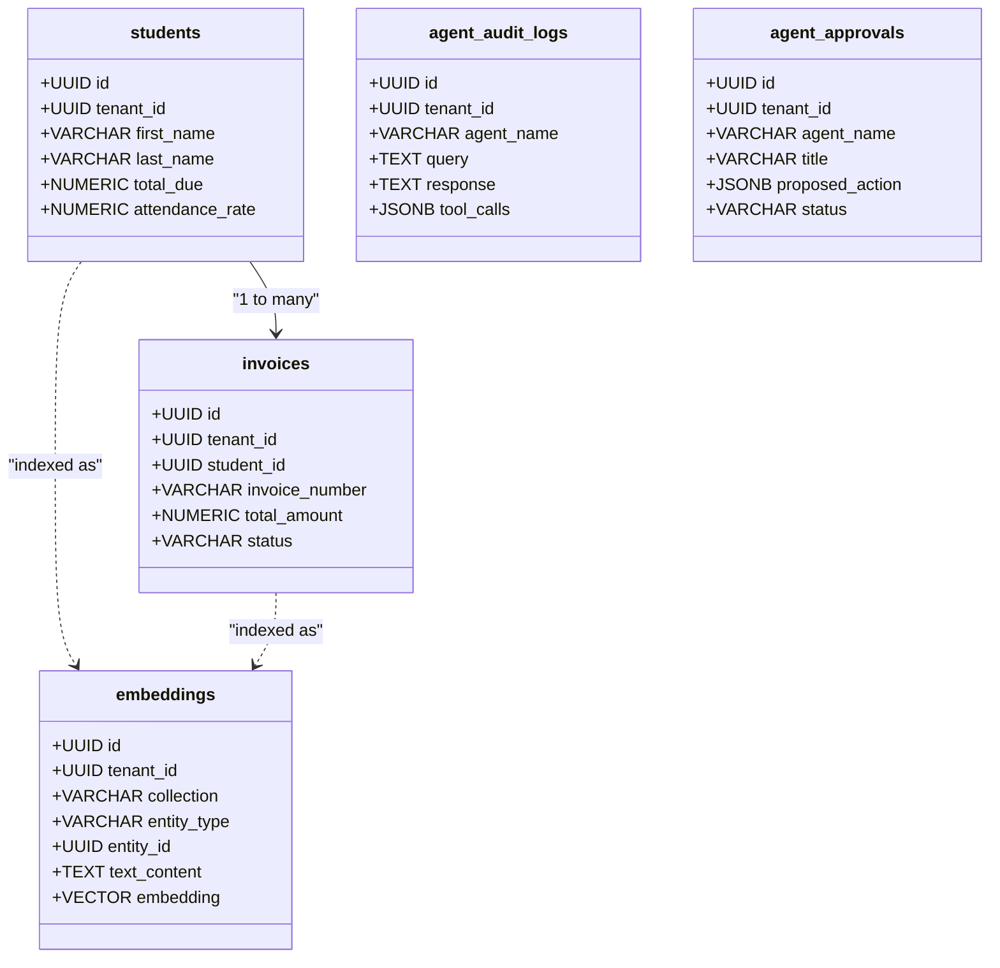

# ScholarMind V6 — Database & Vector Specification

This document details the database architecture, Drizzle schemas, pgvector definitions, and textual representations used for RAG operations.

## 🗄️ Relational & Vector Schema Topology

ScholarMind utilizes Drizzle ORM to map the standard transactional database, while using a custom PostgreSQL schema extension (`pgvector`) for context-aware RAG querying.



---

## 🔬 Textual Representation & Semantic Translation

To maximize LLM understanding, database entities are transformed into structured natural language representations before being embedded using a 1024-dimensional model.

### 1. Student Profile Format
```text
Student Profile: Arjun Patel (ID: ADM-2025-001)
Grade/Section: Grade 8 Section A
Gender: MALE
Status: ACTIVE
Guardian: Rajesh Patel (FATHER, Phone: +919876543210)
Financials: Total outstanding due balance is ₹15,000.50.
Attendance: Historical attendance rate is 88.50%.
```

### 2. Invoice Format
```text
Invoice INV-2025-001 for Student Rahul Kumar (Grade 10)
Plan: Annual 2025-26
Financials: Billed amount is ₹50,000.00. Paid amount is ₹25,000.00.
Status: PARTIAL (Due Date: 2025-12-15)
```

---

## 🏃 Indexing & Search Scenarios

### Scenario: High-risk Attendance Flagging
When an active student's attendance drops below the default institutional threshold of 75.0%, the representation generator MUST flag it explicitly to enable proactive agent risk correlation.

```gherkin
Given a student record with the following values:
  | first_name      | Priya          |
  | last_name       | Sharma         |
  | attendance_rate | 72.0           |
When the representation is built via build_student_representation()
Then the generated text output MUST contain "ATTENDANCE CRITICAL: Current rate is 72.00% (below threshold of 75%)"
```

### Scenario: Full Re-indexing Flow
```gherkin
Given an authorized API call to "/api/v1/indexing/full-reindex"
When the Indexing Pipeline executes for tenant_id "85815f66-8641-452d-9a0a-a95e4e383e53"
Then it MUST fetch all active student, invoice, and grade_collection rows
And convert each row to its respective natural language representation
And generate a 1024-dimension vector embedding for each
And save them securely in the `embeddings` table with pgvector
```
