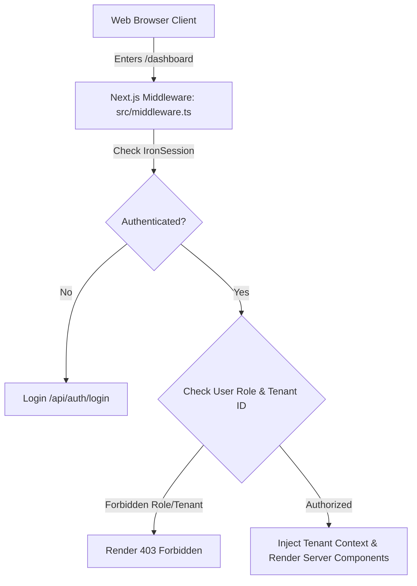

# ScholarMind V6 — Frontend & Presentation Specification

This document details the Next.js presentation layer architecture, multi-tenant boundaries, RBAC middlewares, and the Human-in-the-Loop approval dashboard UI.

## 💻 Web Presentation Stack

The frontend utilizes Next.js 15 App Router with IronSession for session state, Tailwind CSS + Tremor for dashboards, and Radix UI primitives.



---

## 🚪 Multi-Tenant & RBAC Middleware Governance

To prevent IDOR (Insecure Direct Object Reference) and cross-tenant data leaks, all incoming requests MUST pass through the security middleware wrapper.

### Scenario: Intercepting Cross-Tenant URL tampering
```gherkin
Given an authenticated User with tenant_id "85815f66-8641-452d-9a0a-a95e4e383e53"
When the user attempts to load the URL "/dashboard/20e22540-4f11-4403-9632-24425bbd9b76/students"
Then the Next.js middleware MUST intercept the request
And compare the URL segment tenant ID with the user's session tenant ID
And block the navigation with a 403 Forbidden status
```

### Scenario: Blocking Unauthorized Role Actions
```gherkin
Given a user with role "TEACHER"
When the user loads the dashboard
Then the UI MUST hide the "Verifiable Credentials" issuance button
And any API request to "/api/v1/credentials/issue" from this user MUST return a 403 Forbidden response
```

---

## 📥 Human-in-the-Loop (HITL) Approvals Dashboard

The administrative dashboard provides a dedicated queue for reviewing AI-suggested changes that require authorization.

### UI Flow Specification
* **Route**: `/dashboard/[tenantId]/approvals`
* **Filters**: Pending, Approved, Rejected (Default to Pending).
* **Card Details**: Should display:
  - Agent Name (e.g. `FeeAgent`) requesting the change.
  - Action Title and descriptive justification.
  - Raw proposed action arguments in a readable JSON explorer.
  - Approve (Green) / Reject (Red) button controls.

### Scenario: UAT Approval Inbox Actions
```gherkin
Given the Pending approvals inbox displays an action "Modify Student Grade: Arjun Patel"
When the administrator clicks the "Approve" button
Then the client MUST send a POST request to `/api/v1/approvals/[tenantId]/[approvalId]/review` with body `{"action": "APPROVED", "user_id": "[adminUserId]"}`
And the table row MUST slide out with a CSS transition animation
And the app should show a success toast "Action executed successfully."
```
