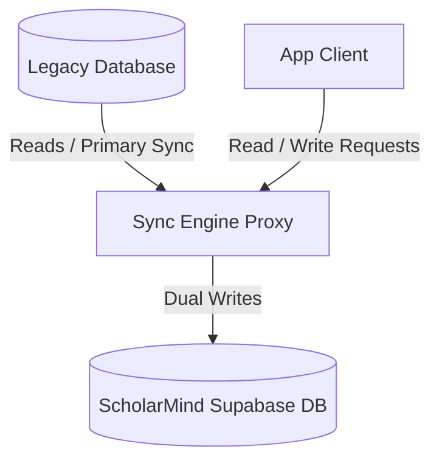

# ScholarMind V6 — Legacy Migration & Coexistence Specification

This document details the strategies, coexistence modes, data reconciliation constraints, and rollback procedures for migrating legacy institution databases into ScholarMind V6.

---

## 1. Migration Coexistence Modes

To minimize operational disruption during long-term transitions, ScholarMind defines three coexistence modes:



1. **Direct Cutover (Low Risk / Standard)**:
   - *Description*: Campuses under 2,000 active students execute offline database migrations during weekend maintenance windows.
   - *Validation*: Full dry-run import check. Direct cutover.

2. **Dual-Write Proxy Coexistence (High Complexity)**:
   - *Description*: Large university systems write transactional data to both the legacy database and the modern ScholarMind database simultaneously.
   - *Verification*: A background audit worker reconciles transactional balances every 60 seconds.

3. **Read-Heavy Replication (Migration Transition)**:
   - *Description*: ScholarMind serves as the primary system of record for all new writes, while old historical transcripts are retrieved on-demand from the legacy database.

---

## 2. Record Reconciliation & Integrity Rules

Prior to final switchover, the import pipeline must satisfy strict data reconciliation gates:

### 2.1 Student Profile Deduplication
- **Matching Rules**: Match on `email`, `national_id_number` or combination of `first_name` + `last_name` + `date_of_birth`.
- **Conflict Strategy**: If a match is found, merge historical attendance and course records, but flag contradictory guardian contacts for manual review.

### 2.2 Financial Ledger Balance Integrity
- **Balance Matching**: Calculated outstanding due balances in ScholarMind must match the legacy ledger:
  $$\text{Legacy Outstanding Balance} = \text{Total Invoiced} - \text{Total Paid} - \text{Approved Concessions}$$
- **Discrepancy Threshold**: Zero tolerance for currency errors. Any discrepancy immediately halts the migration.

---

## 3. Rollback & Disaster Fallback Procedures

Each migration run must define a rollback window. If operational checks fail post-deployment, a complete system state rollback is triggered.

### 3.1 Rollback Trigger Conditions
- High API exception rates (P99 latency > 2000ms or error rates > 2.0% within the first 60 minutes).
- Mismatched multi-tenant isolation logs.
- Failure to verify database connections or Supabase pooling capacity.

---

## 4. Verification Scenarios (BDD)

### Scenario: Dry-run Verification Failure
```gherkin
Given a legacy database with 5,000 student records
And 50 student profiles lack valid "email" and "guardian_name" fields
When the migration runner executes a "dry_run" import check
Then the pipeline MUST:
  1. Halt import execution.
  2. Write validation details to the `migration_errors` audit table.
  3. Respond with status "VALIDATION_FAILED" listing the invalid record IDs.
```

### Scenario: Automated Rollback on High Failure Rate
```gherkin
Given a migration is executed and marked "ACTIVE_COEXISTENCE"
When post-migration monitoring detects HTTP 500 error rates exceeding 2.0%
Then the orchestration layer MUST:
  1. Trigger an emergency alert to the "SUPER_ADMIN" role.
  2. Route all API traffic back to the legacy database nodes.
  3. Transition the ScholarMind database to read-only mode.
  4. Log the rollback event in the system audit logs.
```
